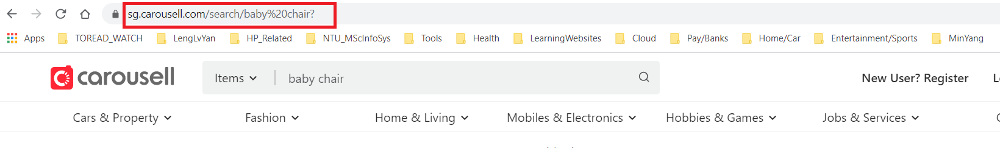
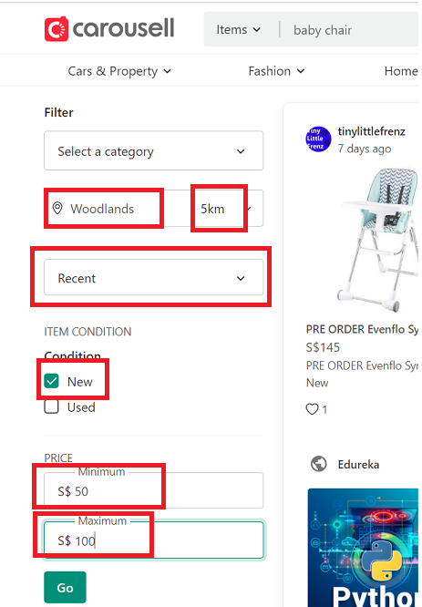
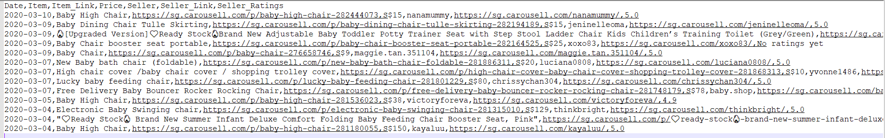

### <a id="problem">PROBLEM</a> STATEMENT
**Carousell** is a smartphone and web-based consumer to consumer and business to consumer marketplace for buying and selling new and secondhand goods. Since it was founded in year 2002, it has been one of the most popular online marketplace in Singapore. My family has had very satisfied experiences using it to purchase our household stuffs mainly due to its concise and intuitive user interface.  

My family needs to buy a baby chair for our baby boy. We have decided to purchase it from [carousell.com](carousell.com). The key criteria which we use to decide which baby chair to buy are its *price*, its *condition*, the *seller’s ratings* and the *seller’s location*. Searching from [carousell.com](carousell.com) directly often returns a page full of unnecessary and distracting details like advertisements and sponsored items. 

Our goal is to collect only the items which match our criteria efficiently and effectively. We need tools which automate the whole process and return the result datasets in a clear and concise manner. By analyzing the datasets, we can decide which baby chair to purchase. We will use `Selenium` and `Webcrawler` to achieve this goal.  

Below are summary of the item and its key criteria:  

Website: **https://sg.carousell.com/**  
Item: **Baby Chair**  
Condition: **New**    
Seller’s location: **Within 5km from Woodlands**  
Price Range: **$5 to $150**    
Seller’s Ratings: **The more stars the better. The maximum number of stars is five.**    

The results should be returned from the most recent first as we prefer to buy latest posted item. The results should include *title*, *link*, *price*, *seller* and *seller’s ratings*. 

This web scraper is developed and run in iPython notebook `carousell_scraper.ipynb`.  

### COLLECTION OF DATA

#### Formation of URL
First, I visited [sg.carousell.com](sg.carousell.com) in my browser to have a feel of how its search works and how its results are displayed. This is done to prepare the URL and the parsing of HTML contents of the main page and results.   

Based on the criteria stated in [Problem Statement](#problem), I tested [sg.carousell.com](sg.carousell.com) by searching items by entering “baby chair” in the search box. I obtained the resulting URL as shown below:  

Based on the criteria stated in Problem Statement, I filtered the results by choosing the related options as shown below. Similarly, the URL for the filter results was obtained.  

From the web browser (Google chrome) address bar, the URL was https://sg.carousell.com/search/baby%20chair?condition_v2=NEW&location_name=Woodlands&price_end=100&price_start=50&range=5&sort_by=time_created%2Cdescending  

Based on the resulting URL, I constructed the URL to be used in my web scraper. The following is a summary of the query strings used:  
    1. *condition_v2* – **NEW** or **USED**.  
    2. *location_name* – the location in Singapore of the item. In my case, it is **Woodlands**.  
    3. *price_start* – the minimum accepted price for the item. In my case, it is **5 (in SGD)**.  
    4. *price_end* – the maximum accepted price for the item. In my case, it is **150 (in SGD)**.  
    5. *range* – the accepted distance from location_name. Our family only wants item located within **5km from Woodlands**.  
    6. *sorted_by* – how results are being display, i.e. most popular first, most recent first, price (from high to low) and price (from low to high). In our case, we want the latest item only which is recent first. From the URL, it is **time_created**, **descending** (Note: %2C maps to , in ASCII table).  
    
###  Web Scraper Development

The following Python modules are used in my web scraper:  
    1. `Selenium` –  It is used to access Selenium Webdriver for Chrome to automate accessing the URL. It is also used to save the page source and a snapshot.  
    2. `BeautifulSoup` – It is used to parse the HTML for the page and extract data from it like item name, item’s posted date, seller’s id, seller’s ratings and etc.  
    3. `urllib` – It is used to access the URL.  
    4. `re` –With its string pattern searching and matching, it is used together with `BeautifulSoup` to extract data.  
    5. `csv` – It helps in writing the extracted data into csv file to be used by my family.  
    
The web scraper (iPython notebook `carousell_scraper.ipynb`) is made up of a class `CarousellScraper`. The key methods are as below:  
    1. `Constructor` which initializes the `URL` and `Selenium` web driver. It also prepares folders for saving raw data and processed data.
    2. Method `load_carousell_url` which uses `Selenium` Webdriver to load the URL, save its snapshot and the page source.
    3. The key method `extract_item_details` which  
        a. Loads the URL via `urllib` and read its content.  
        b. Uses `BeautifulSoup` to parse the HTML content for seller’s id, seller’s URL, date posted, item’s title, item’s URL, price and seller’s ratings. I found that many returned results do not contain both “baby” and “chair” in the item’s title. Hence, Additional filtering is done to only extract item with item’s title having both words of “baby” and “chair”.   
        c. Uses `csv` module to output the processed results to csv file to help us decide which baby chair is worth buying.  
    4. Helper methods like   
        a. `return_date` that returns the date of post by subtracting current date with message like “1 day ago”, “5 minutes ago” and so on.  
        b. `shorten_url` that shortens url for seller’s link and item’s link by removing long alphanumeric strings.  
        c. `extract_item_seller_ratings` that uses urlopen from urllib.request module and BeautifulSoup to read HTML content of seller’s link and parse for seller’s rating.  
        d. `quit` that closes the web browser opened via a call to Selenium Webdriver.  
        
### ANALYSIS OF OUTPUTS
Running the script as shown in the iPython notebook `carousell_scraper.ipynb` generates the following output files:  
    1. In `raw` folder:
        a. Screenshot of the page with filename format of  `YYYYmmdd_HHMMSS_CarousellSearch.png`.  
        b. Page source with filename format of `YYYYmmdd_HHMMSS_CarousellSource.html`.  
    2. In `processed` folder – the csv file with filename format of `YYYYmmdd_HHMMSS_Carousell_Search_babychair.csv`. The columns in the file are *Date,Item,Item_Link,Price,Seller,"Seller_Link, Seller_Ratings*. Figure below shows the sample output of the csv file.
    

### CONCLUSION
In general, using Python modules like `Selenium`, `BeautifulSoup`, `urllib`, `re` and so on helps me to collect the data I want. It also processes the data by removing the unnecessary messages and simplify them for us to use for our decision making. With task scheduler in Windows 10, I schedule this task to run in certain time of the day and only need to check the csv files after work. It saves me time to visit the website. This technique used can be applied to other functions like checking of flight tickets, analysis of football matches, weather data monitoring and so on.  

### REFERENCES
    1. https://selenium-python.readthedocs.io/index.html
    2. https://docs.python.org/3/library/datetime.html?highlight=datetime#datetime.timedelta

  

